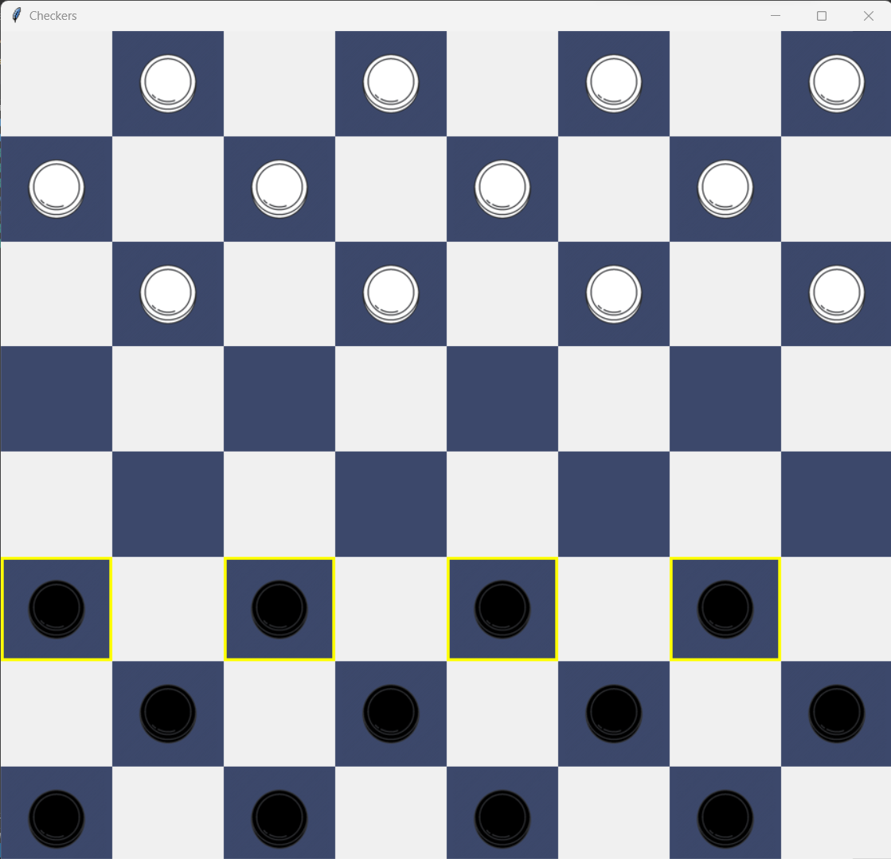

# Checkers 
- I created a graphical user interface for the checker game using the Tkinter library. The user interface consisted of a game board, pieces, and buttons to move the pieces.
- I implemented the alpha-beta pruning algorithm to create an AI player that could play against human players. The AI player used the algorithm to search through the game tree and determine the best move to make.
- Algorithm: Alpha-Beta Pruning Algorithm

## Preview

